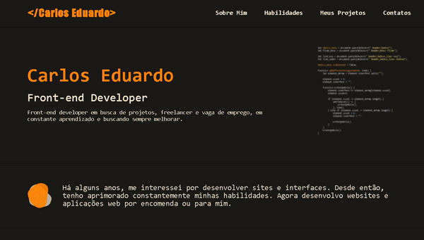

<h1 align="center">Portifolio</h1>

> Este é meu portifolio e nele há alguns projetos que desenvolvi totalmente do zero sem ficar copiando codigo da internet, se quiser dar uma olhada agradeço <a href="https://carloseduardori.github.io/Portifolio-Projetos/">Visite a página</a>  
> Caso quiser dar uma olhada no meu linkedin e se interessar <a href="https://www.linkedin.com/in/carlos-eduardo-ribeiro-do-patrocinio/">Linkedin</a>

  

 <h3 align="center">Tecnologias utilizadas:</h3>
 
 [Badges]: <> ( Você pode procurar por badges aqui: https://github.com/alexandresanlim/Badges4-README.md-Profile )
 

## ✨ Atualizações:

- Adicionei alguns novos projetos que desenvolvi junto com o curso da origamid

## 📫 Contribuindo para Portifolio

Para contribuir, siga estes passos:

1. Fork este repositório.
2. Crie uma branch com seu nome de recurso: `git checkout -b mynewfeature`.
3. Faça suas alterações e confirme: `git commit -m 'messagehere'`
4. Push sua mudança para a branch principal: `git push origin mynewfeature`
5. Crie a solicitação pull request.

você pode verificar a documentação do GitHub [Criando uma Pull Request](https://help.github.com/en/github/collaborating-with-issues-and-pull-requests/creating-a-pull-request).

## 🤝 Contribuintes

## 📝 Licença
Este projeto está sob licença. Verifique a [LICENÇA](LICENSE) para obter mais detalhes.

[⬆ Volte para o topo!](https://github.com/carloseduardori/Portifolio-Projetos) 
